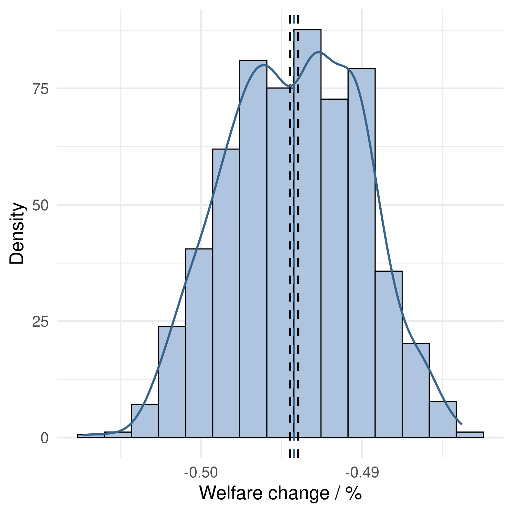

# CGE model sensitivity analysis for Hübler et al. (2022)

This repo contains R code for the sensitivity analysis of the computable general equilibrium (CGE) model developed in Hübler et al. (2022). Using household data from the German Income and Expenditure Survey, we analyze distributional effects of climate policy 
in Germany in a CGE model calibrated to GTAP 10 data (Aguiar et al. 2019). We find that the negative consumption effect of CO2 pricing is highest for the low-income group, whereas the negative income effect is highest for the high-income group and exceeds
the consumption effect. The low-income group benefits most from (per capita-based redistribution of) carbon pricing revenues and receives social transfers such that poor households can be better off with such climate policies than without them. CO2 pricing of imports at the EU border strengthens these distributional effects and is mainly beneficial for the low-income group.

To check the robustness of our findings, we conduct a distributional sensitivity analysis of relevant sets of elasticity parameter values within our CGE model. The sensitivity analysis is carried out using the [Snakemake](https://snakemake.readthedocs.io/en/stable/) workflow management system. In this repo, we provide R code for generating parameter spaces for the sensitivity analysis,
processing the output files from the model runs and generating histograms of the resulting welfare effect distributions.

## 1. Setting up the R environment

First, open the R project file [climate-trade-distribution-sensitivity.Rproj](climate-trade-distribution-sensitivity.Rproj) in RStudio. It is important to work using the .RProj file, as it is associated with the directory that the project is located in and will set the working directory accordingly.
After opening the R project file, open [setup.R](setup.R). Running the file will set up an R environment using the `renv` package, which manages project-local R dependencies to ensure that existing data analysis workflows work as they did before;
for more information see https://rstudio.github.io/renv/articles/renv.html

Proceed as follows:

1. Call `options(repos = c(REPO_NAME = "https://packagemanager.rstudio.com/cran/2023-03-17"))`
to load the CRAN snapshot from RStudio Package Manager. This will freeze to the R packages as they were available at the time that the analysis was conducted.

2. Install `renv` by calling `install.packages("renv")`.

3. Call `renv::init()` to initialize a new project-local environment with a private R library.
`bare = TRUE`: instead of installing dependencies automatically, we install packages manually.

4. Install the required packages.

5. Call `renv::snapshot()` to save the state of the project library.

The state of the library is saved in the [renv.lock](renv.lock) file.

## 2. Generating parameter spaces

[paramspaces.R](scripts/paramspaces.R) generates parameter spaces for the model runs of the sensitivity analysis. In particular, three sets of sector-level elasticity of substition parameters are considered, for which baseline values are
taken from Pothen and Hübler (2018):

- ``esubd``: elasticities between domestically produced versus imported goods
- ``esubm``: Armington elasticities
- ``esubva``: elasticities between production factors

For each set of parameters, we generate 1000 random draws from a +-10 % interval around each of the sector-specific elasticities, resulting in 1000 sets of sectoral parameter values.
The parameter spaces as well as the baseline values with +-10 % intervals are stored as .CSV files in [paramspaces](paramspaces). Each row in the parameter space .CSV files corresponds to one set of parameter values, and each column corresponds to one of the 17 sectors of the CGE model. The following abbrevations are used for the sectors:
- ``AGR``: Agriculture
- ``COA``: Coal
- ``CRU``: Crude oil
- ``NGA``: Natural gas
- ``PET``: Refined petroleum
- ``FOO``: Food production
- ``MIN``: Mining
- ``PAP``: Paper and pulp
- ``CHE``: Chemicals, rubber and plastic
- ``NMM``: Mineral products nec.
- ``IRS``: Iron and steel
- ``NFM``: Non-ferrous metals
- ``MAN``: Manufacturing
- ``ELE``: Electricity
- ``TRN``: Transport
- ``CON``: Construction
- ``SER``: Services

## 3. Processing data on welfare effects

The CGE model is programmed as a mixed complementarity problem (MCP) in general algebraic modeling system (GAMS; Bussieck and Meeraus 2004).
For each set of parameter values, we recalibrate and solve the model and evaluate the welfare effects for our policy scenarios.
Each model run produces an .XLSX output file with the model results for the respective set of parameter values in a dedicated subfolder; the output files can be found [here](https://drive.google.com/drive/folders/1AfjqhgV3Nl9SPAXqZ9UmK4E8U-cjW-TL?usp=sharing).

Welfare effects of the two policy scenarios (*domestic CO2 price* and *border CO2 price*, labeled ``policy`` and ``cbam``, respectively) on the three income groups (low-, middle- and high-income, labeled ``lo``, ``mi`` and ``hi``, respectively) are expressed as percentage changes relative to the baseline scenario with no policy. In the .XLSX output files, these effects can be found in the sheet "welfp". [welf_data.R](scripts/welf_data.R) extracts the welfare effects from the output files and collects them in a separate data frame for each set of elasticity parameters in [prepared](prepared). When replicating the analysis, make sure to provide the directory in which the .XSLX output files are stored at the top of the script:
```
# clear workspace
rm(list = ls())

# this is where you put the output files from the sensitivity analysis
# (use separate subdirectories for esubd(i), esubm(i), and esubva(j))
dir = "C:/Users/Marius Braun/output_sensitivity"
```

Importantly, pay attention to where you store the output files, as the file paths of the subdirectories produced in the sensitivity analysis are relatively long, e.g.:

```
C:/Users/Marius Braun/output_sensitivity/esubm/mAGR=2.5/mCOA=10.118/mCRU=8.152/mNGA=7.421/mPET=10.028/mFOO=3.602/mMIN=2.425/mPAP=4.883/mCHE=4.121/mNMM=5.963/mIRS=4.577/mNFM=4.14/mMAN=4.897/mELE=18.928/mTRN=6.544/mCON=14.747/mSER=5.913/output.xlsx
```

Depending on the file path of the directory that they are stored in, the file path length may exceed the file path length limit of 255 characters. If the file path length of the subdirectories exceeds this limit, you will not be able to read the output files in R.

## 4. Histograms

[histograms.R](scripts/histograms.R) produces histograms of the distributions of welfare effects by policy scenario and income group for each parameter set. As an example, the following figure shows the distributions of welfare effects of *Domestic CO2 price* for varying Armington elasticities ``esubm``. Kernel density estimations are indicated by solid blue lines, and dashed vertical black lines represent 95% confidence intervals obtained via percentile bootstrapping.

|Low-income|Middle-income|High-income|
|-----|-----|-----|
||||

Analogously, histograms of welfare effects by policy scenario and income group are produced for ``esubd`` and ``esubva``.

## References
Aguiar, A., M. Chepeliev, E.L. Corong, R. McDougall and D. van der Mensbrugghe (2019). The GTAP data base: version 10. *Journal of Global Economic Analysis* 4, 1–27. [https://doi.org/10.21642/JGEA.040101AF](https://doi.org/10.21642/JGEA.040101AF)

Bussieck, M. R. and A. Meeraus (2004), General Algebraic Modeling System (GAMS), in: Kallrath, J. (ed.), *Modeling Languages in Mathematical Optimization*, p. 137–157, Springer US, Boston, MA. [https://doi.org/10.1007/978-1-4613-0215-5_8](https://doi.org/10.1007/978-1-4613-0215-5_8)

Hübler, M., M. Wiese, M. Braun and J. Damster (2022), The distributional effects of CO2 pricing at home and at the border on
German income groups, ROCHADE Working Paper. [https://rochade-project.org/de/Assets/documents/2022-09-29_huebler-wiese_distributional-effects-of-german-co2-pricing.pdf](https://rochade-project.org/de/Assets/documents/2022-09-29_huebler-wiese_distributional-effects-of-german-co2-pricing.pdf)

Pothen, F. and M. Hübler (2018), The interaction of climate and trade policy, *European Economic Review* 107, 1-26. [https://doi.org/10.1016/j.euroecorev.2018.04.004](https://doi.org/10.1016/j.euroecorev.2018.04.004)
